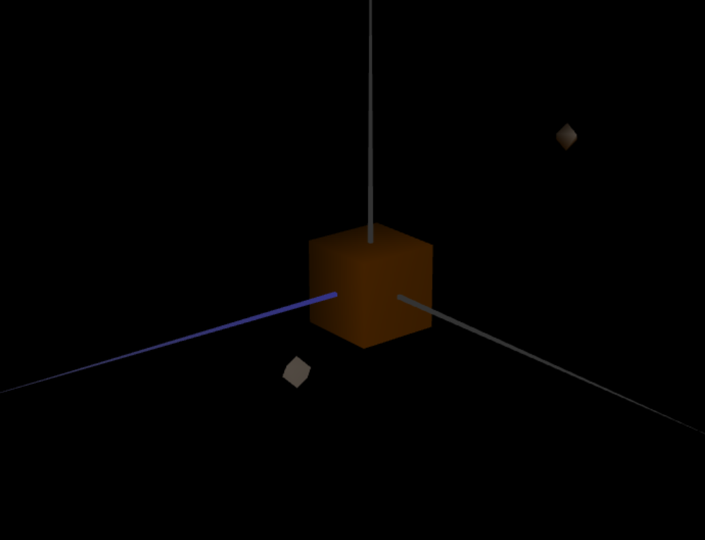
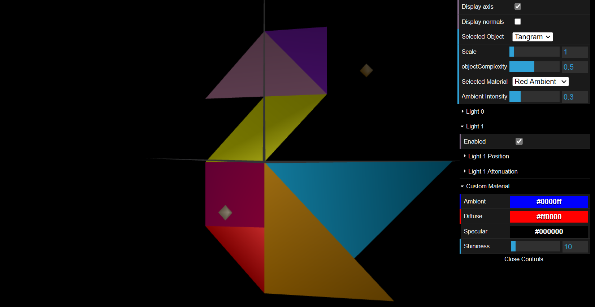
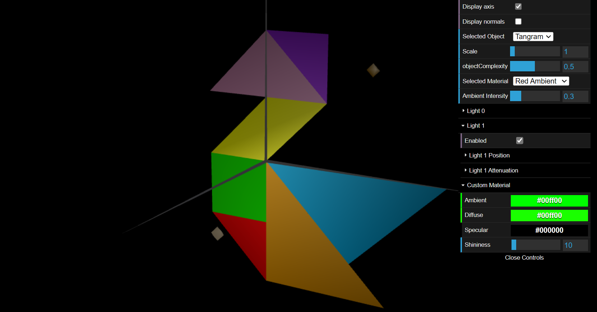
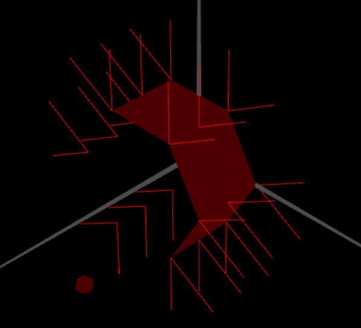
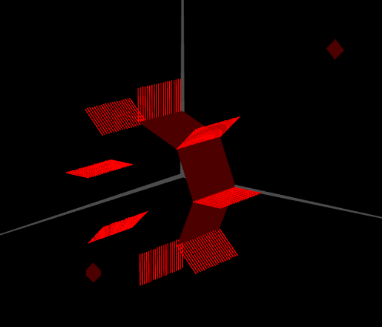

# CG 2022/2023

## Group T04G05

## TP 3 Notes

### Part1 - Exercise 1: Wood Cube with Specular Light

### Part1 - Exercise 2: Tangran with diferent colors and diamond customize

### Part2 - Exercise 3: Prism with Normals

### Part3 - Exercise 4: Cylinder with Normals

