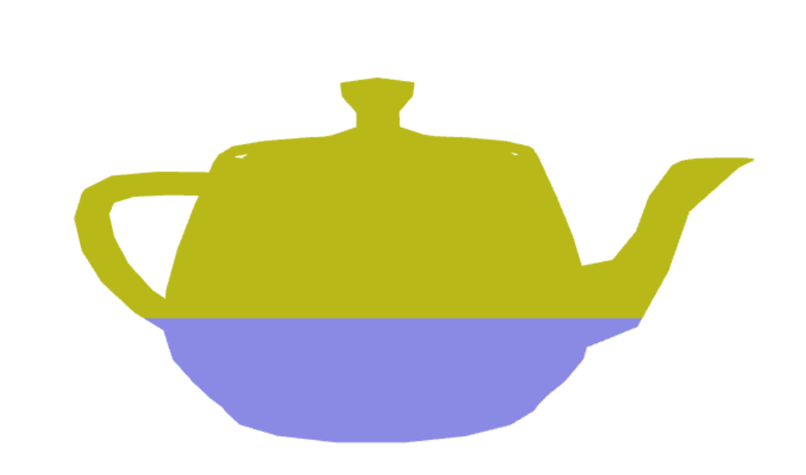
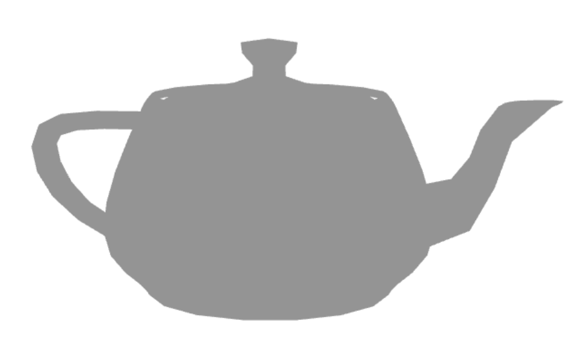

# CG 2022/2023

## Group T04G05

## TP 5 Notes

### Exercise 1: Teapot with new shsader

### Exercise 2: Changed grayscale

### Exercise 3: Water Shader

<video src="https://git.fe.up.pt/cg/cg-2022-2023/t04/cg-t04-g05/-/blob/master/tp5/screenshots/cg-t04g05-tp5-3.mp4" controls="controls">
<video>
